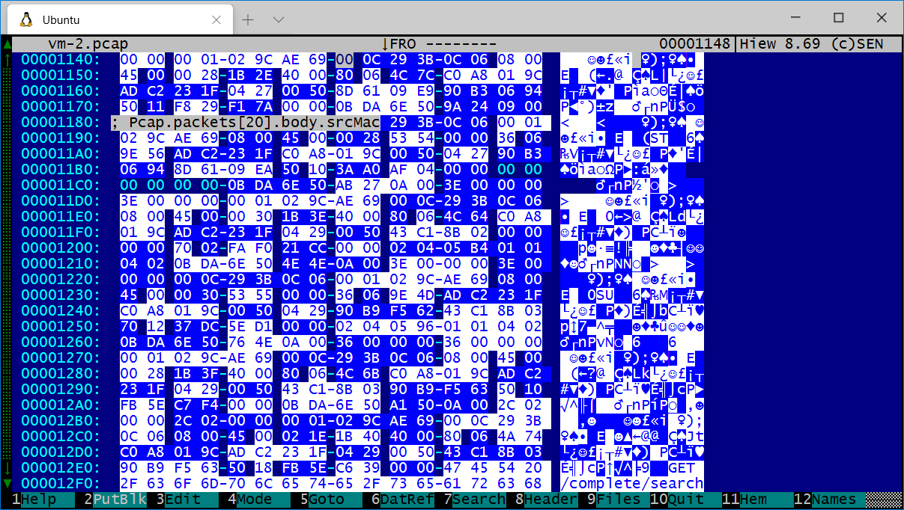
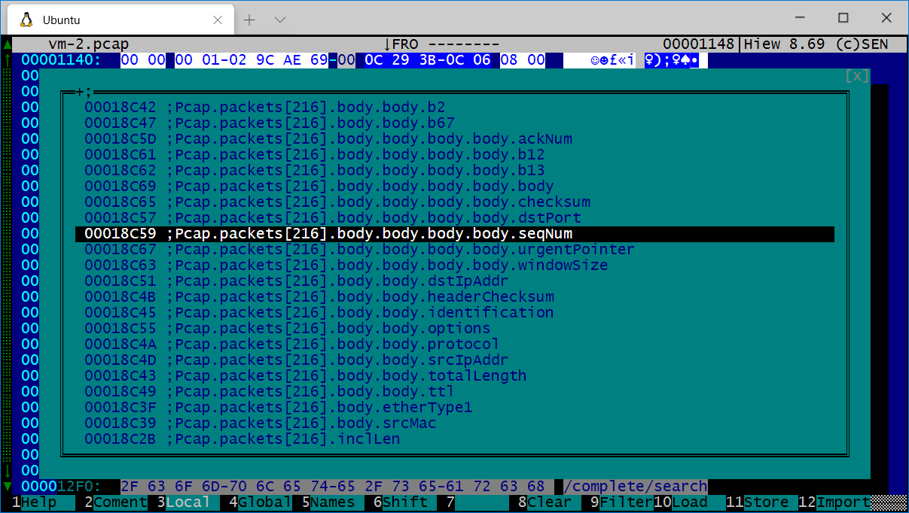

# Introduction

Kiewtai is a HEM (aka plugin) for the [Hiew](http://www.hiew.ru/) hex editor
that makes all the binary parsers from the [Kaitai](https://kaitai.io/) project
available. This means you can get all the fields marked and decoded for dozens
of popular file formats. You can also use the Kaitai format to write a new
template for a file format you're analyzing.

> Click [here](https://formats.kaitai.io/) to see a list of all the formats
> supported by Kaitai.

Want to see it in action? See some [Screenshots](#screenshots)!


# Installation

> If you don't want to build it yourself, check out the
> [releases](https://github.com/taviso/kiewtai/releases)  tab


Copy `kiewtai.hem` to your `hem` folder, which should be where you installed
`hiew`.

# Usage

Press `F11` and Select `Kiewtai: Kaitai Struct format parsers`.

You will be shown a list of all supported parsers, select the one you want.

Kiewtai will highlight the different fields, and add a comment describing the
field.


# Advanced Usage

> If you want Kiewtai to analyze a section of a larger file, for example you
> have a firmware blob or filesystem image, Simply mark the section you want
> analyzed with `*` first. If you work in DFIR, you might call this "carving".

 - Press `F2` to toggle between Simple and Detailed parsing.

The default parsing mode is verbose, try this if you prefer.

 - Press `F3` to enable or disable comments.

Kiewtai will add comments to Hiew describing each field, these are displayed as
you navigate around. You can also browse and search them with `F12`.

- Press `F4` to enable or disable markers.

Kiewtai will add color markers by default so you can easily see where the
different fields are. Press `F4` if you don't like this.

- Press `F5` to search for a parser.

The list of parsers is quite long, press `F5` and enter some search terms if
you  like.


# Notes

> If you're a Hiew user and want to help make better documentation, click 
> [here](https://github.com/taviso/hiewdocs)!

This project uses the following third party libraries:

- HEM SDK v0.53 [http://www.hiew.ru/](http://www.hiew.ru/)
- Kaitai Struct  v0.9 [https://kaitai.io/](https://kaitai.io/)
- Duktape v2.5.0 [https://duktape.org/](https://duktape.org/)
- JSMin [http://crockford.com/javascript/](http://crockford.com/javascript/)

Please feel free to file an issue for any bugs, missing features or documentation!

Oh, and I prounounce Kiewtai "cue-tie". `:)`

# Screenshots

Here are some screenshots of different Kiewtai screens.

## Browsing a GIF header

You can see the  magic, version, descriptors, dimensions are all identified.

The comment shows Kiewtai knows the cursor is on the `applicationId` field.

> The individual R/G/B bytes are hilighted, which makes the data look
> stripey. If that's *too* much verbosity, press `F2` on the parser
> list and Kiewtai will reduce the level of detail it generates.


## Show the recognized fields in an EXE file.

You can load multiple Kaitai parsers at once, this screenshot shows the
[DosMz](https://formats.kaitai.io/dos_mz/index.html) and
[MicrosoftPE](https://formats.kaitai.io/microsoft_pe/index.html) parsers
loaded simultaneously.

If you have an embedded file, simply
[mark](https://taviso.github.io/hiewdocs/#mark) it and Kiewtai will only
analyze that block.


## Browsing the chunks of a PNG image.

The field names display as comments as you navigate around a file.


## Browsing Formats available.

Kaitai has parsers for dozens of popular formats already made, you can  see the
full list online [here](https://formats.kaitai.io/). The list is long, you type
`F5` to serach it.


## Automatically handle common subformats.

Here Kiewtai parsed a pcap file, and all the Tcp, Udp, Icmp, packets and
Ethernet frames inside the pcap are automatically recognized. This all happened
automatically when loading the Pcap parser!






# Building

> If you don't want to build it yourself, check out the
> [releases](https://github.com/taviso/kiewtai/releases) tab

I used Visual Studio 2019 to develop Kiewtai.

This project uses submodules for some of the dependencies, be sure that you're
using a command like this to fetch all the required code.

```
git submodule update --init --recursive

```

1. Download and Install the [Kaitai Struct compiler](https://kaitai.io).
2. If you don't have them already, install Open JDK, GNU make, and GNU binutils.

If you use chocolatey, this command should be enough:

```
> choco install make openjdk mingw
```

3. Open a Visual Studio Developer Command Prompt.
4. Type `make.exe`

If everything worked, you should have a file called `kiewtai.hem`

> If you get `The system cannot find the file specified` errors, verify
> `objcopy.exe`, `make.exe` and `kaitai-struct-compiler.bat` are all in your
> `%PATH%`.

## Testing

There are some simple tests in the `test` directory that verify some common
formats are working as expected.

Simply type `make` in the `test` directory to run them.

# Author

Tavis Ormandy <taviso@gmail.com>
